# Let your AI agents paint big arrows, boxes and text on your screen

**big-arrow-on-the-screen** (`bigarrow`) is a macOS command-line tool, plus a skill for Claude Code and Codex, that draws an arrow and a sign on top of every window. Clicks go through, your keyboard focus stays put, and the arrow removes itself. MIT licensed.

[](https://github.com/franzenzenhofer/big-arrow-on-the-screen/actions/workflows/ci.yml)
[](LICENSE)


[Real apps](#real-apps-real-use-cases) · [Copy buttons](#copy-buttons-copy-then-paste) · [What is it for?](#what-is-this-actually-for) · [Install](#install) · [Commands](#the-three-commands-an-agent-needs) · [Looks](#looks) · [Creative arrows](#creative-arrows) · [Starred by](#starred-by) · [FAQ](#faq) · [How we know it works](#how-we-know-it-works) · [For agents](#for-agents-and-the-humans-who-configure-them) · [Plan](#plan-decisions-research) · [Prior art](#prior-art-and-thanks) · [License](#license)

> Your AI agent can refactor a monorepo, write a migration and explain monads, but when it needs you to click one button it prints *"please click Allow in the dialog"* into a terminal you are not looking at. `bigarrow` gives it a finger.

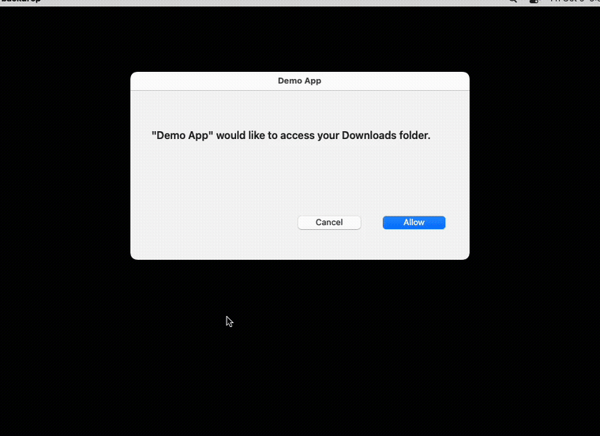

```bash
bigarrow point --element "Allow" --app "System Settings" --text "Franz, click Allow: Ghostty may control your Mac"
```

One transparent window above everything, on every display and every Space. Drawing needs **no macOS permission at all**. One Swift binary: no daemon, no menu-bar icon, no account, no telemetry, and, we checked twice, no AI inside. It is an arrow.

## Real apps, real use cases

Real apps on a real Mac (macOS 27), the real `bigarrow`, staged by `scripts/real-scenes.sh`.

### macOS Desktop & Dock: stop "click wallpaper to show desktop"


["The most annoying change in Mac update history"](https://www.imore.com/mac/macos/macos-sonoma-click-to-reveal-desktop-turn-off), fixed in six arrows ([MP4](docs/videos/wallpaper.mp4)).

### System Settings: grant a permission


```bash
open "x-apple.systempreferences:com.apple.preference.security?Privacy_Accessibility"
bigarrow start --element Terminal_Toggle --app "System Settings" \
  --text "Franz, switch this on: Terminal may control your Mac" --from right --color green --close-button
bigarrow start --element Add --role button --app "System Settings" \
  --text "Not in the list? Plus. Then find it." --from bottom-right --style ring --color orange --shape zigzag --size S
```

### Keynote: a three-step how-to


```bash
bigarrow start --element Animate --app Keynote --role radiobutton --text "1. Click Animate" --from right \
  --style ring --color purple
bigarrow start --element "Add an Effect" --app Keynote --text "2. Add an Effect" --from right \
  --style box --corners sharp --color "#FF9F0A" --shape straight
bigarrow start --element Play --app Keynote --role button --text "3. Press play. Bask in the applause." \
  --from top --color teal --shape zigzag --size S
```

### Print dialog: helping Mom save a PDF

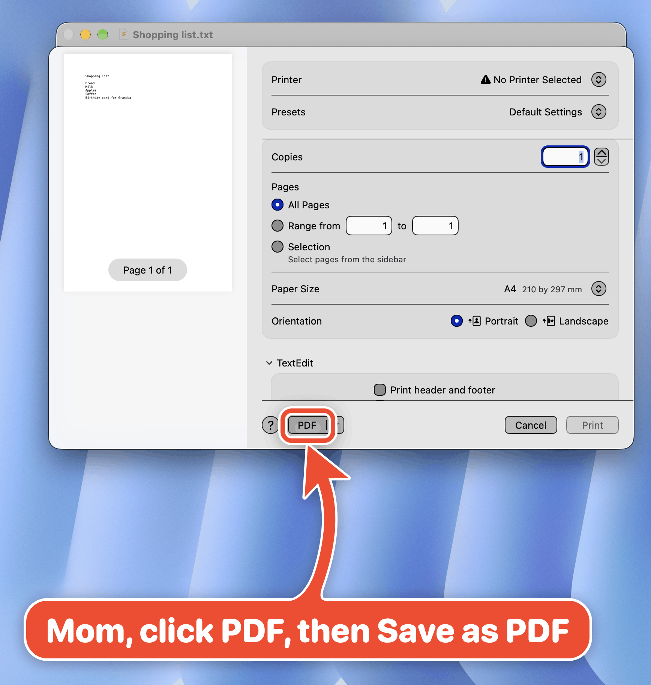

```bash
bigarrow start --element PDF --role button --app TextEdit \
  --text "Mom, click PDF, then Save as PDF" --from bottom --color pink --border white-black
bigarrow start --element Cancel --role button --app TextEdit \
  --text "Not this one, Mom" --from bottom-right --color black --size S
```

### Chrome: the right tab out of 14


```bash
bigarrow start --app "Google Chrome:Sourdough" --element "Sourdough - Wikipedia" --role radiobutton \
  --text "It's this tab, not the other 13" --from top --shape zigzag --color "#5856D6" --size L
```

`--app "App:tab title"` raises the window and selects the tab first.

### Finder: "no, the other grid icon"


```bash
bigarrow start --element "icon view" --role radiobutton --app Finder \
  --text "Not this one" --from top-left --style ring --color black --size S
bigarrow start --element Group --role menubutton --app Finder \
  --text "No, the other grid icon. This one." --from top --style box --color green
```

### A real guide: allow screen recording

<a href="docs/guides/allow-screen-recording/how-to-allow-screen-recording-on-a-mac.pdf"></a>

The whole guide as a 6-page PDF, every screenshot an arrow an agent drew. [Download the PDF](docs/guides/allow-screen-recording/how-to-allow-screen-recording-on-a-mac.pdf) or [read it here](docs/guides/allow-screen-recording/README.md).

## Copy buttons: copy, then paste

Sometimes the human has to paste something: a command the agent may not run, a URL, a code. Put it in the sign between `{{` and `}}` and it gets a copy button. One click copies it, the icon turns into a check, and the arrow stays where the value goes.

### Terminal: a sudo command the agent must not type

**Before the click:** the command on a copy button, the arrow at the prompt.

![Terminal, a failed xcodebuild: You have not agreed to the Xcode license agreements, admin privileges required. A blue arrow with a yellow border at the empty prompt line: Franz, Xcode needs your password once. Copy [sudo xcodebuild -license accept, copy icon] paste it here, press Return.](docs/images/real/copy-terminal.png)

**Just copied:** the icon turns into a check, Cmd-V has pasted the command, the arrow is still there.

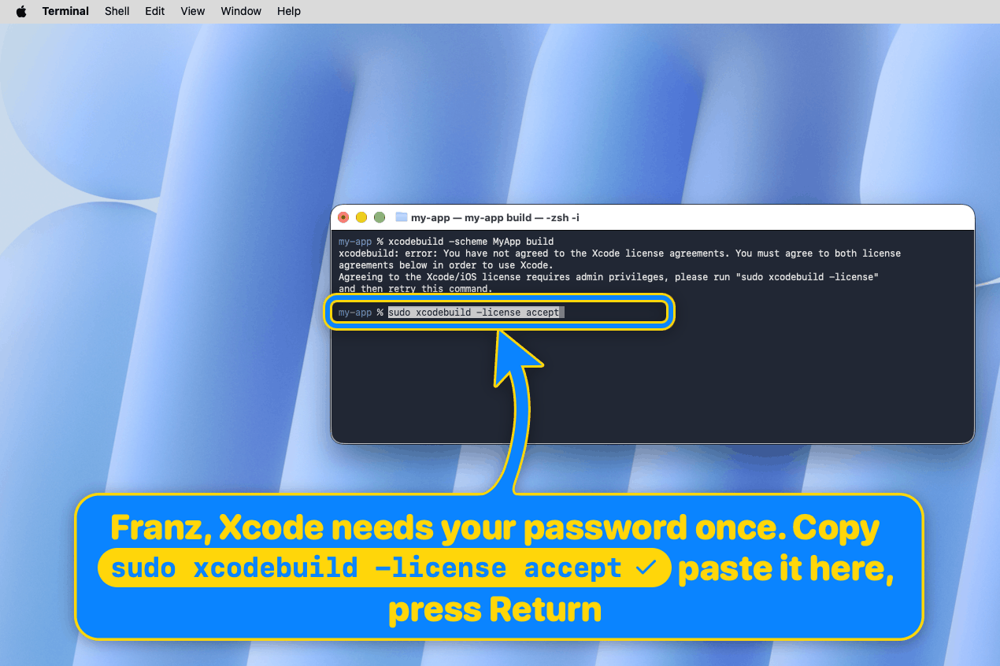

```bash
bigarrow start --rect 424,386,420,20 --app "Terminal:my-app" --from bottom \
  --color blue --border-color yellow --text-color yellow \
  --text "Franz, Xcode needs your password once. Copy {{sudo xcodebuild -license accept}} paste it here, press Return"
```

The agent never sees the password, and the human never retypes a command.

### Chrome: open the preview

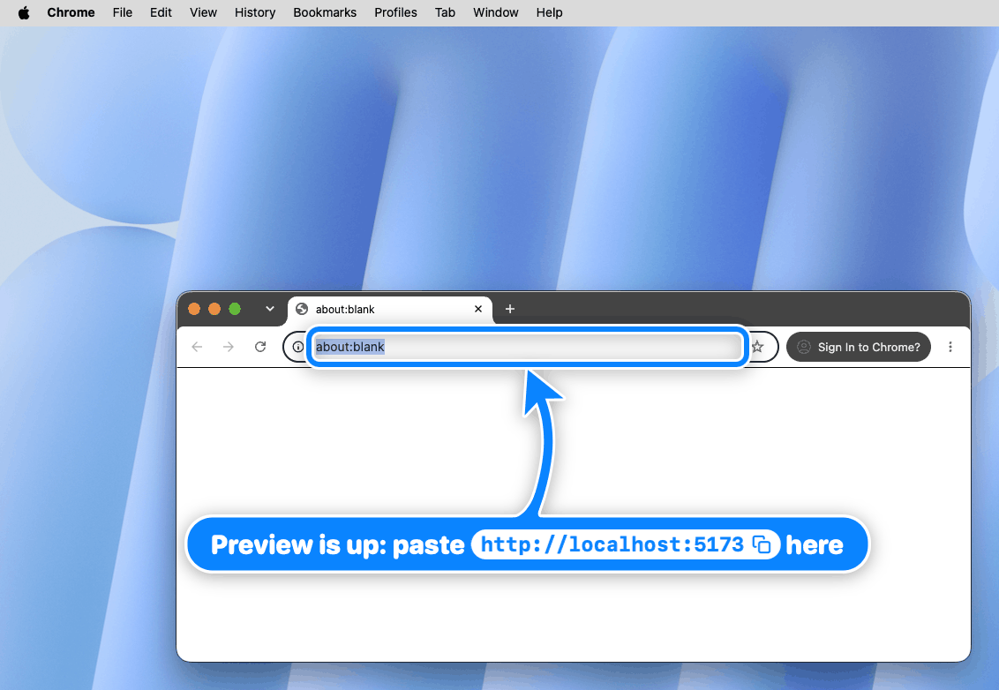

```bash
bigarrow start --element "Address and search bar" --app "Google Chrome" --from bottom-right --size S \
  --color blue --border-color yellow --text-color yellow \
  --text "Preview is up: paste {{http://localhost:5173}} here"
```

The chip takes the sign's text colour, so a yellow-on-blue sign gets a yellow button with the URL in blue.

- Several values per sign work: `"User {{franz}}, password {{correct horse}}"`. A value wider than the sign is shortened in the middle on screen; the whole value is copied.
- A click on the chip copies and keeps the arrow; a click anywhere else on the sign or the shaft still removes it. No permission: the clipboard needs none.
- `--json` gives every chip's frame (`copyButtons`, global top-left points) and, when the arrow ends, how often it was copied (`copied`). `--say` reads the sentence without the braces.
- The copy and check icons are [Feather](https://feathericons.com)'s (MIT), see [THIRD_PARTY_NOTICES.md](THIRD_PARTY_NOTICES.md).

## What is this actually for?

Fair question. Arrows have existed since roughly the Paleolithic. What changed: agents now do real work on your Mac, and sooner or later hit a step **only a human may do**, or one the human wants to learn.

- **"Click Allow."** Permission prompts, OAuth consent, "Open with...?". The agent finds the button but must not, or cannot, press it. It can point.
- **"Your turn."** 2FA, CAPTCHAs, passkeys, payments, signatures. It points, you decide, it continues.
- **"Paste this."** A `sudo` command, a URL, a code: on the sign with a [copy button](#copy-buttons-copy-then-paste), the arrow on where it goes.
- **"I need you, and you're making coffee."** `--say` reads the sign aloud. Your Mac will literally call you back to your desk.
- **"Show me how."** Ask how to do something in Blender, and the agent points at each control in turn. A product tour, minus the product.
- **Helping someone else.** On a parent's Mac or over a screen share, pointing beats "the button at the top, no, the other top".
- **Demos and docs.** Highlight while recording, or render straight to a PNG with `--png`.
- **Debugging coordinates.** Point at your Accessibility or Peekaboo coordinates and look. `--dry-run --json` says where it *would* point.

Not a screen annotator, not a click bot, not a screenshot tool. It never clicks, types or captures. It only points. Deliberately.

## Install

```bash
brew install franzenzenhofer/tap/bigarrow
bigarrow install-skill          # teaches Claude Code (~/.claude/skills) and Codex (~/.agents/skills)
```

From source: `swift build -c release` (Xcode 16+, macOS 14+), binary at `.build/release/bigarrow`. The binary is pure Swift; `scripts/` only records screenshots and runs tests.

## The three commands an agent needs

```bash
bigarrow point --element "Allow" --app "System Settings" --text "Franz, click Allow"   # by label
bigarrow point --at 760,500 --text "Franz, click HERE"                                 # by coordinate
bigarrow start --window "Safari:Inbox" --text "This window" && bigarrow stop            # until stopped
```

Every arrow ends by itself. Nobody has to clean up after an agent that forgot:

| | |
|---|---|
| Time limit | `--duration 10` (`point` 8 s, `start` 300 s, `0` = no limit) |
| Start and stop | `start` returns at once; `stop` (or `stop --all`) removes it |
| The agent goes away | the arrow ends with the agent process that drew it (`CLAUDE_PID` or `BIGARROW_OWNER_PID`) |
| The human answers | `bigarrow stop --hook` as a Claude Code `UserPromptSubmit` hook clears that session's arrows |
| The human closes it | `--close-button` (opt-in) |

Targets: `--at X,Y`, `--rect X,Y,W,H`, `--mouse`, `--window App[:title]`, `--element Label --app App`, `--peekaboo ID --snapshot see.json`. Coordinates are global top-left logical points, as Accessibility and Peekaboo report them; `--display N` makes them relative to one display.

`--app App[:window or tab title]` (or `--window`) first brings that app, window or Chrome/Safari tab to the front, because pointing at a window hidden behind your terminal is a special kind of unhelpful. If another app covers the target later, the arrow hides until it is visible again. `--no-raise` opts out. `bigarrow elements --app X` lists what `--element` can match; `bigarrow doctor` shows permissions and displays.

Every command takes `--json`. Exit codes: 0 ok, 2 bad input, 3 target not found, 4 permission missing. Agents love exit codes. Humans tolerate them.

## Looks

It is an arrow, so we spent an unreasonable amount of time on how it looks.

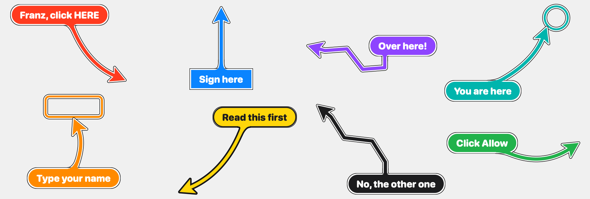

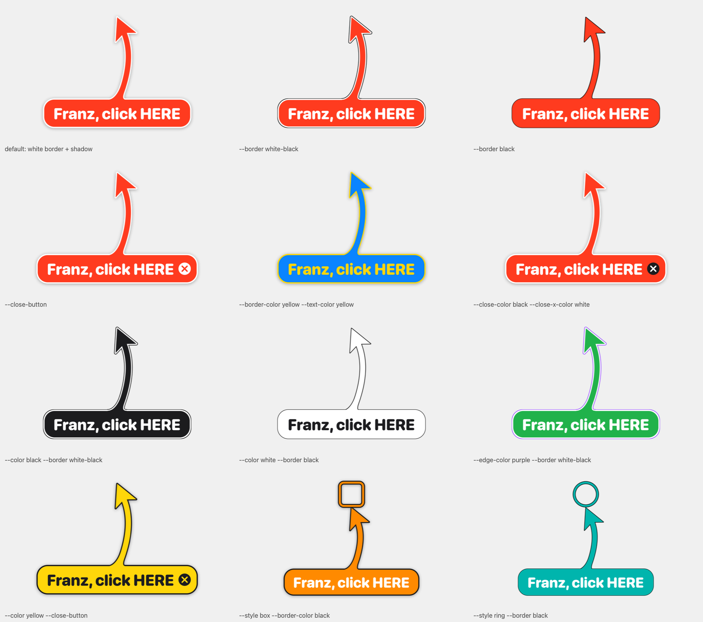

Six looks over white, macOS grey, dark, black, red and a busy web page:


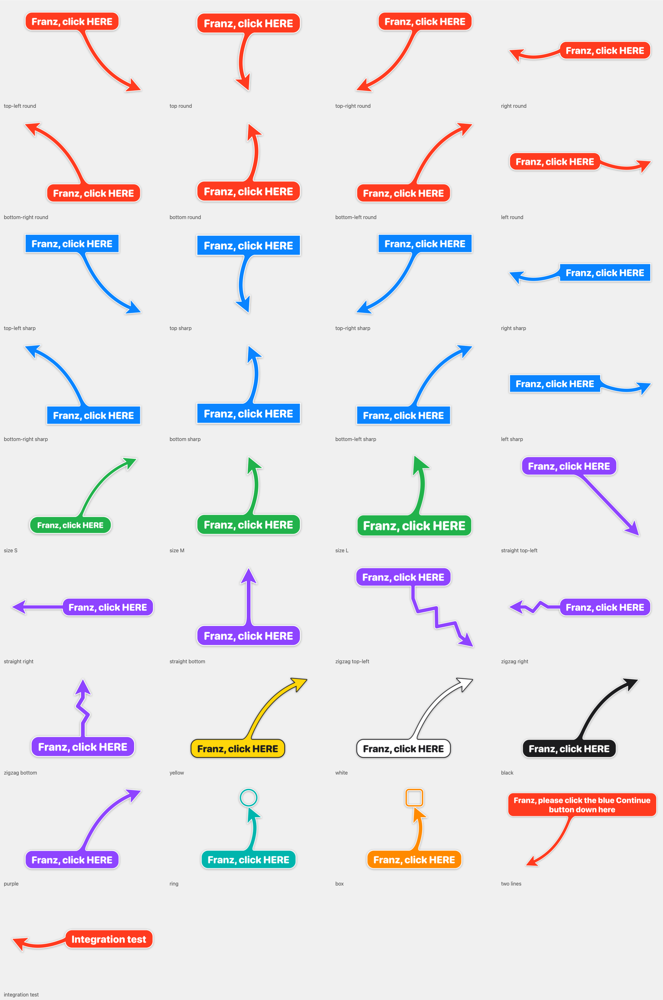

- `--shape bend|straight|zigzag|spiral`: zigzag for when it is *really* urgent; spiral loops once around the sign, for when it must be impossible to miss
- `--style arrow|ring|box` (rings and boxes are outlines, the target stays visible), `--size S|M|L`, `--corners round|sharp`
- `--color red|orange|yellow|green|teal|blue|purple|pink|black|white|#RRGGBB`
- `--border shadow|white-black|black`: white border with drop shadow (default), a thin black edge instead of the shadow, or just a thin black outline
- `--border-color`, `--text-color`, `--edge-color`, `--close-color`, `--close-x-color`; left out, each picks a readable colour
- `{{value}}` in `--text` becomes a [copy button](#copy-buttons-copy-then-paste); `--close-button` puts an X inside the sign's right end; `--follow` moves with a window or element; `--until-click` ends on a click on the target; `--say` speaks the sign
- Several arrows at once keep their signs out of each other's way

`scripts/gallery.py` renders every combination and zooms into every sign-to-shaft joint ([junctions](docs/images/junctions.png)), because a seam at the joint was, apparently, unacceptable.

## Creative arrows

Fake dialogs, real `bigarrow`, clean CI runner (`BACKDROP_ARGS=--cover scripts/funny-scenes.sh`). The dialogs are fake. The feelings are real.

### Delete node_modules: the easiest yes of your life

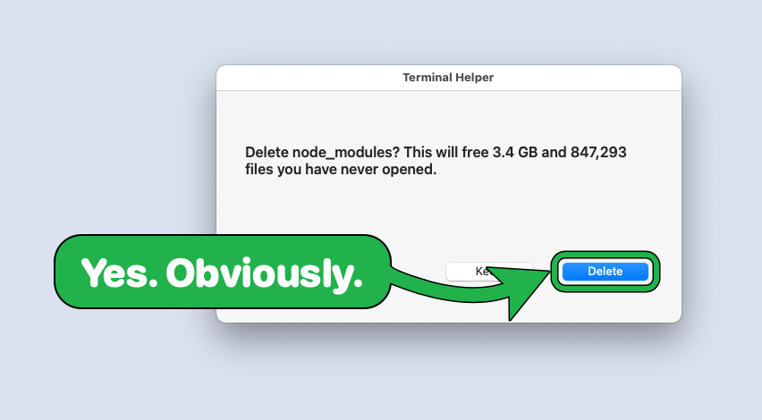

`--color green`, because some decisions are easy

### Cookie banner: the zigzag of mild urgency

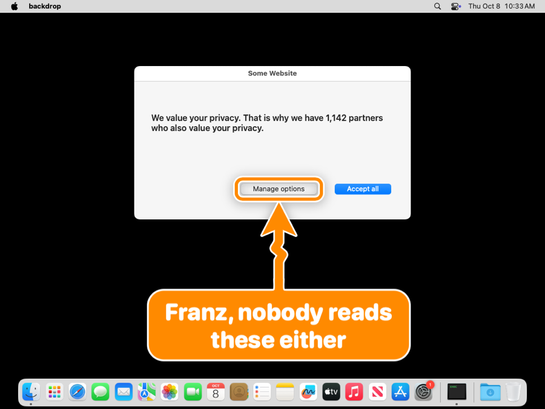

`--shape zigzag --color orange`

### Software update: one lap of honour


`--shape spiral`: once around the sign, then to the button

### 2FA: find your phone

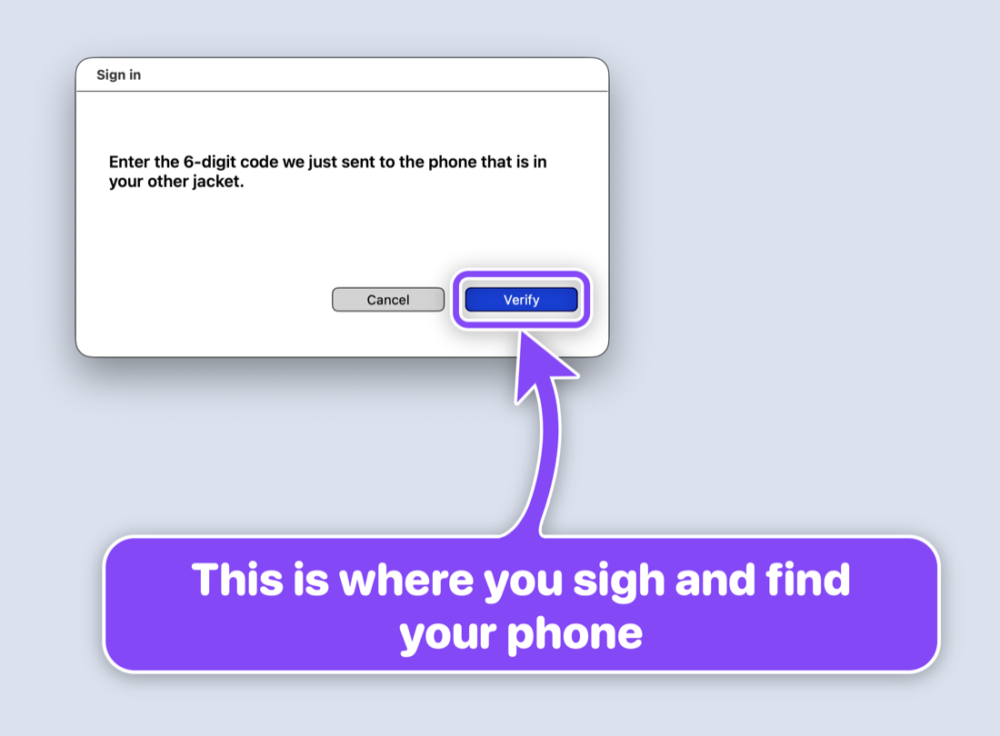

`--color purple`

### Friday deploy: the agent votes Cancel

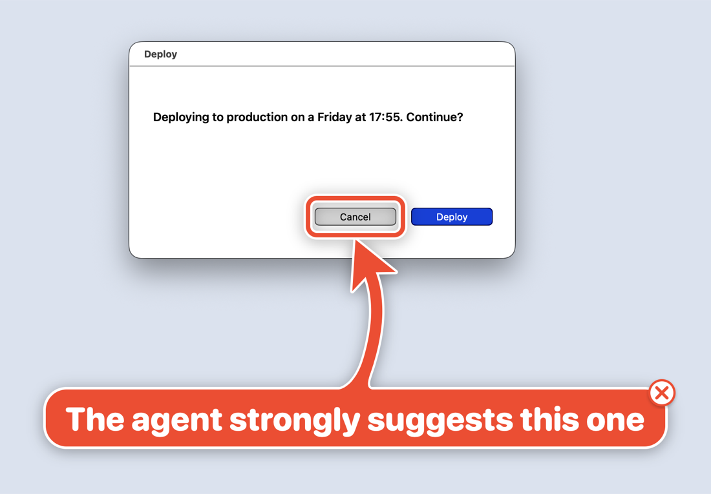

`--close-button`, because the human gets the last word

### Save: three arrows, one button

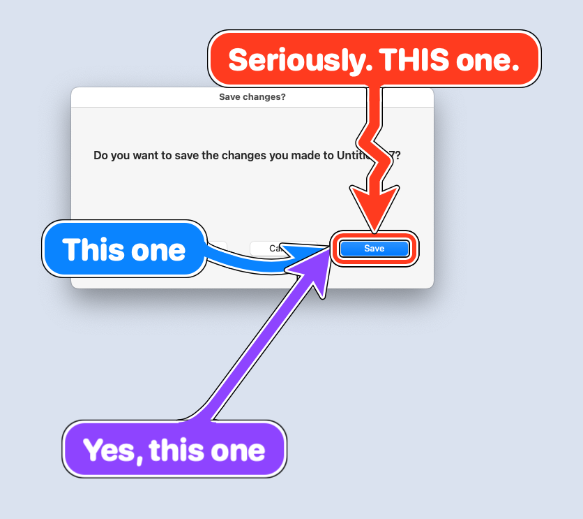

three `start`s, one button, zero ambiguity

### Permissions: Terminal, not bigarrow

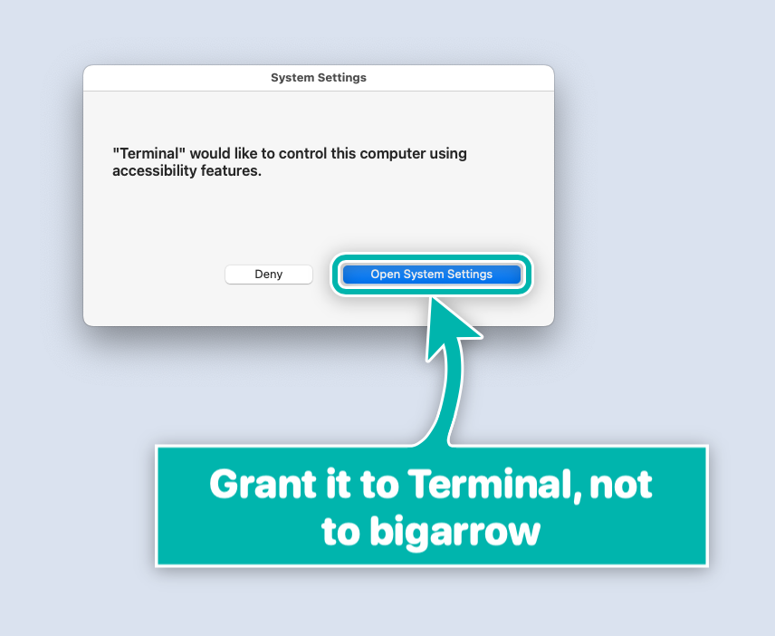

`--style box --corners sharp`, plus a lesson about macOS permissions

## Starred by

[](https://github.com/franzenzenhofer/big-arrow-on-the-screen/stargazers) Nearly 400 stars in the first two days, from people whose GitHub profiles list **Apple, NVIDIA, AMD, SAP, Salesforce, ServiceNow, Booking.com, Mercedes-Benz, SUSE, Oxide Computer, Posit, CoreWeave, Weights & Biases, OpenRouter, Metabase, InstaDeep, Benchling, Stainless** and **Under Armour**, plus Stanford, Johns Hopkins, KTH and Oak Ridge National Laboratory.

## FAQ

[Permissions?](#does-it-need-screen-recording-or-accessibility) · [In front without focus?](#it-never-takes-the-focus-how-is-it-in-front) · [Steals my typing?](#will-it-steal-my-focus-while-im-typing) · [Click through?](#can-i-click-through-it) · [Displays and Spaces?](#multiple-displays-full-screen-apps-stage-manager-spaces) · [CPU?](#how-much-cpu-does-a-pulsing-arrow-cost) · [Web pages?](#does---element-work-inside-web-pages) · [Can it trick me?](#could-an-agent-use-this-to-trick-me) · [Token cost?](#why-a-skill-is-that-a-lot-of-tokens) · [Why not an annotation app?](#why-not-just-use-a-screen-annotation-app) · [Is it AI?](#is-it-ai)

### Does it need Screen Recording or Accessibility?

**Drawing: no.** Some ways of finding the target do:

| You use | Permission |
|---|---|
| `--at`, `--rect`, `--mouse`, `--window App`, `--peekaboo`, `--app App` | none |
| `--element`, `elements`, `--until-click`, `--app App:title` | Accessibility |
| `--window App:title` (macOS 26 hides window titles) | Screen Recording, plus Accessibility to raise (not with `--no-raise`) |

macOS grants these to the app that started `bigarrow` (Terminal, iTerm2, Ghostty, VS Code, Claude), never to `bigarrow` itself, so switch on that app. `bigarrow doctor` names it; a missing permission exits with code 4 and names the app and the settings pane.

### It never takes the focus. How is it in front?

**On top and focused are two different things on macOS.** The arrow sits at screen-saver level, above windows, dialogs and full-screen apps, but never becomes the active window.

### Will it steal my focus while I'm typing?

**No.** That was the hardest bug in the project: `NSApplication.run()` quietly activates a process without a terminal. `bigarrow` pumps events itself, and the tests check that the frontmost app never changes.

### Can I click through it?

**Yes, everywhere except the sign and the shaft.** A click there removes the arrow (it dims under the pointer to say so). Clicks on the target or near the head go straight to the app, without taking the focus.

### Multiple displays? Full-screen apps? Stage Manager? Spaces?

**Yes, yes, yes, yes.** Negative coordinates included. Unplug a display while an arrow is on it and the arrow politely leaves. See the [verification matrix](docs/verification/multi-display.md).

### How much CPU does a pulsing arrow cost?

**1.4 % on a CI runner.** Core Animation does the work in the render server.

### Does `--element` work inside web pages?

**In Electron apps, yes. In Chrome, only with help.** Chrome needs `--force-renderer-accessibility` (or VoiceOver on); it ignores the usual request (verified October 2026). Chrome's own toolbar always works. Otherwise point at page coordinates, which the skill explains.

### Could an agent use this to trick me?

Say, by covering the Decline button? **Not beyond what it can already do.** An agent that runs shell commands as you can do far worse, so `bigarrow` gives it nothing new. Still, each checked by a test: boxes and rings are outlines, so the target stays visible; the sign keeps clear of the target (or overlaps it as little as possible); a click on sign or shaft removes the arrow; every arrow ends by itself. And the skill makes the sign say what your click does.

### Why a skill? Is that a lot of tokens?

**182 tokens, most of the time.** That is the skill's description, the only part the agent always sees. The instructions, 1,398 tokens (Anthropic's token-count API, Claude Opus 5.5), load only when it decides to point; pane ids and look flags (1,008 more) only when it needs them.

### Why not just use a screen annotation app?

**Those are for humans drawing on screens.** This is for programs pointing at things, from a shell, with exit codes. Twenty-six tools were checked first ([research](docs/research/)). None did this.

### Is it AI?

**No.** It is the least intelligent part of your AI stack, and proud of it.

## How we know it works

- 104 automated tests: geometry, placement, joints, a golden image, copy buttons, recorded window-server, Accessibility and Peekaboo fixtures, and the real window server (click-through, focus never moves, stop timing). CI runs macOS 15; also passed on macOS 26 and 27.
- 18 behaviour checks on a clean runner ([visual.yml](.github/workflows/visual.yml)): clicks on the X, a copy button (the clipboard holds the value, the arrow stays), `--until-click`, `--follow`, raising and `--no-raise`, hiding while covered, Chrome tab selection, owner exit, `stop --hook`, `--say`, full-screen, Stage Manager, Spaces, second and 2x displays, unplugging mid-arrow, CPU.
- A fresh agent given only the skill and "show Franz where the Reload button in Chrome is" found it by label and built the right command ([transcript](docs/skill-tests/2026-10-08-chrome-reload.md)). It also found a bug, which is now a test.

## For agents (and the humans who configure them)

`skill/big-arrow/` (Agent Skills format, plus `agents/openai.yaml` for Codex) teaches the agent when to point, how to pick a target, to write a full sentence on the sign, to `--say` it when you are away, and to `stop` once you acted.

## Plan, decisions, research

`docs/plan/PLAN.md`, `docs/plan/TICKETS.md` (generated from `tickets.json`), `docs/decisions/`, `docs/research/`, `docs/verification/`, `docs/skill-tests/`, `CHANGELOG.md`.

## Prior art and thanks

Peekaboo (https://github.com/openclaw/Peekaboo) and Nameplate (https://github.com/steipete/Nameplate) by Peter Steinberger showed the overlay recipe and the skill packaging. Neither points with a labelled arrow. `bigarrow` reads Peekaboo's `see --json` as a target source.

## License

MIT. Point responsibly.
