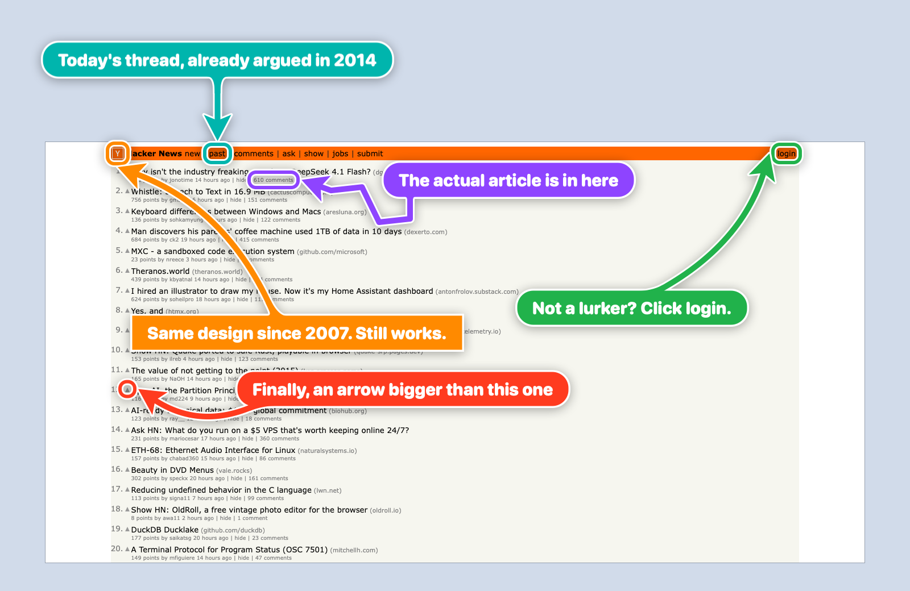

# Let your AI agents paint big arrows, boxes and text on your screen

**big-arrow-on-the-screen** (`bigarrow`) is a macOS command-line tool, plus a skill for Claude Code and Codex, that draws an arrow and a sign on top of every window. Clicks go through to the app below, your keyboard focus stays where it is, and the arrow removes itself. MIT licensed.

[](https://github.com/franzenzenhofer/big-arrow-on-the-screen/actions/workflows/ci.yml)
[](LICENSE)



> Your AI agent can refactor a monorepo, write a migration and explain monads, but when it needs you to click one button it prints *"please click Allow in the dialog"* into a terminal you are not looking at. `bigarrow` gives it a finger.


```bash
bigarrow point --element "Allow" --app "System Settings" --text "Franz, click Allow: Ghostty may control your Mac"
```

The arrow lives in its own transparent window above all other windows, on every display and every Space. Clicks on the target land in the app underneath, and drawing needs **no macOS permission at all**. It is one Swift binary: no daemon, no menu-bar icon, no account, no telemetry, and, we checked twice, no AI inside. It is an arrow.

## What is this actually for?

Fair question. Arrows have existed since roughly the Paleolithic. Here is what changed: software agents now do real work on your Mac, and sooner or later they reach a step **only a human may do**, or one the human wants to learn to do.

- **"Click Allow."** macOS permission prompts, OAuth consent screens, "Open with...?" dialogs. The agent can find the button but must not, or cannot, press it for you. It can now point at it.
- **"Your turn."** 2FA codes, CAPTCHAs, passkeys, a payment confirmation, a signature, a legal checkbox. The things an agent should never click on its own behalf. It points, you decide, it continues.
- **"It's this window, not that one."** You have 14 Chrome windows. The agent knows which one it means: `--window "Google Chrome:Pull request"`. It even picks the right tab: `--app "Google Chrome:Pull request"`.
- **"I need you, and you're making coffee."** `--say` reads the sign aloud. Your Mac will literally call you back to your desk.
- **"Show me how."** Ask your agent how to do something in Keynote, Blender or System Settings, and it points at each control in turn instead of describing it: `start`, wait until you acted, `stop`, next step. Like a product tour, minus the product.
- **Helping someone else.** Install it on a parent's Mac, and the agent there can show them how to save a document as PDF. Pointing beats "the button at the top, no, the other top".
- **Remote help.** "No, the *other* gear icon." Point at it instead of describing it.
- **Demos, screencasts, docs.** Highlight what matters while recording, or render the arrow straight into a PNG with `--png` for documentation.
- **Debugging coordinates.** Not sure your Accessibility, screenshot or Peekaboo coordinates are right? Point at them and look. `--dry-run --json` tells you where it *would* point without drawing.

### Situations we have all been in

Staged with a neutral demo dialog and recorded with the real `bigarrow` on a clean CI runner (`BACKDROP_ARGS=--cover scripts/funny-scenes.sh`). The dialogs are fake. The feelings are real.

| | |
|---|---|
|  |  |
| `--color green` | `--shape zigzag --color orange` |
|  |  |
| `--color purple` | `--close-button`, because the human gets the last word |
|  |  |
| three `start`s, one button, zero ambiguity | `--style box --corners sharp`, plus a lesson about macOS permissions |
|  | |
| `--shape spiral`: once around the sign, then to the button | |

What it is not: a screen annotator for humans, a click bot, or a screenshot tool. It never clicks, types or captures anything. It only points. Deliberately.

## Install

```bash
brew install franzenzenhofer/tap/bigarrow
bigarrow install-skill          # teaches Claude Code (~/.claude/skills) and Codex (~/.agents/skills)
```

From source: `swift build -c release` (Xcode 16 or newer, macOS 14 or newer), binary at `.build/release/bigarrow`. The binary is Swift only; the shell and Python files in `scripts/` record screenshots and run tests.

## The three commands an agent needs

```bash
bigarrow point --element "Allow" --app "System Settings" --text "Franz, click Allow"   # by label
bigarrow point --at 760,500 --text "Franz, click HERE"                                 # by coordinate
bigarrow start --window "Safari:Inbox" --text "This window" && bigarrow stop            # until stopped
```

Every arrow ends by itself. Nobody has to clean up after an agent that forgot:

| | |
|---|---|
| Time limit | `bigarrow point ... --duration 10` (default 8 s; `start` 300 s; `--duration 0` = no limit) |
| Start and stop | `bigarrow start ...` returns at once; `bigarrow stop` (or `stop --all`) removes it |
| The agent goes away | an arrow ends when the agent process that drew it exits (`CLAUDE_PID`, or `BIGARROW_OWNER_PID`) |
| The human answers | `bigarrow stop --hook` as a Claude Code `UserPromptSubmit` hook clears that session's arrows |
| The human closes it | `--close-button` puts a clickable X on the sign (opt-in) |

Targets: `--at X,Y`, `--rect X,Y,W,H`, `--mouse`, `--window App[:title]`, `--element Label --app App`, `--peekaboo ID --snapshot see.json` (from Peekaboo's `see --json`). Coordinates are global top-left logical points, the space Accessibility, CGWindowList and Peekaboo report. `--display N` makes `--at` and `--rect` relative to one display.

An arrow is tied to the app it points into. With `--app App[:window or tab title]` (or `--window`), bigarrow first brings that app, window or Chrome/Safari tab to the front, because pointing at a window hidden behind your terminal is a special kind of unhelpful. If another app later covers the target, the arrow hides until the target is visible again. `--no-raise` leaves your windows where they are. `bigarrow elements --app X` lists what `--element` can match. `bigarrow doctor` shows permissions, who owns them, and your displays.

Every command takes `--json`. Exit codes: 0 ok, 2 bad input, 3 target not found, 4 permission missing. Agents love exit codes. Humans tolerate them.

## Looks

It is an arrow, so we spent an unreasonable amount of time on how it looks.


Real screenshots on a clean test machine, six looks over white, macOS grey, dark, black, red and a busy web page:


- `--shape bend|straight|zigzag|spiral` (zigzag for when it is *really* urgent; spiral loops once around the sign before it points, for when it must be impossible to miss)
- `--style arrow|ring|box`; rings and boxes are border-only, so you still see what is under them
- `--size S|M|L`, `--corners round|sharp`
- `--color red|orange|yellow|green|teal|blue|purple|pink|black|white|#RRGGBB`
- `--border shadow|white-black|black`: the default is a white border (dark on light colours) with a drop shadow; `white-black` puts a thin black edge outside the white border instead of the shadow; `black` is just a thin black outline
- Every colour is yours: `--border-color`, `--text-color`, `--edge-color`, and for the X `--close-color` and `--close-x-color`. Left out, each picks a readable colour itself
- `--close-button` puts an X inside the sign's right end (white circle, X in the arrow colour), where it never covers the text or leaves the screen
- `--follow` moves with a window or element, `--until-click` ends on a click on the target, `--say` speaks the sign
- Several arrows at once keep their signs out of each other's way

The shaft grows out of the sign through a flared joint that never runs into a rounded corner. `scripts/gallery.py` renders every combination offscreen and zooms into every joint ([junctions](docs/images/junctions.png)), because a seam at the joint was, apparently, unacceptable.

## FAQ

**Does it need Screen Recording or Accessibility?**
Drawing needs nothing. Some ways of finding the target do:

| You use | Permission |
|---|---|
| `--at`, `--rect`, `--mouse`, `--window App`, `--peekaboo`, `--app App` | none |
| `--element`, `elements`, `--until-click`, `--app App:title` (raise a window or select a tab) | Accessibility |
| `--window App:title` (macOS 26 hides window titles) | Screen Recording, plus Accessibility to raise the window (not with `--no-raise`) |

macOS gives these permissions to the app that started `bigarrow`, which is your terminal or IDE (Terminal, iTerm2, Ghostty, VS Code, Claude), never to `bigarrow` itself. So that is the app you switch on in System Settings. `bigarrow doctor` tells you which app it is, and when a permission is missing the command exits with code 4 and names the app and the settings pane.

**It never takes the focus. How is it in front?**
On macOS, being on top and having the keyboard focus are two separate things. The arrow's window sits at the screen-saver window level, above normal windows, dialogs and full-screen apps, but it never becomes the active window, so whatever you are typing keeps going where it was going. With `--app`, the app being pointed at is brought to the front first.

**Will it steal my focus while I'm typing?**
No. That was the hardest bug in the project: `NSApplication.run()` quietly activates a process that has no terminal, so detached arrows grabbed the focus. `bigarrow` pumps events itself instead, and the tests check that the frontmost app never changes.

**Can I click through it?**
Yes, everywhere except the sign and the shaft: a click there removes the arrow (it dims slightly under the pointer to say so). A click on the target, or anywhere near the arrow's head, goes straight through to the app. Clicking the arrow never takes the focus.

**Multiple displays? Full-screen apps? Stage Manager? Spaces?**
Yes, yes, yes, yes. Displays left of or above the main one (negative coordinates) included. Unplug a display while an arrow is on it and the arrow politely leaves. See the [verification matrix](docs/verification/multi-display.md).

**How much CPU does a pulsing arrow cost?**
1.4 % measured on a CI runner. Core Animation does the work in the render server.

**Does `--element` work inside web pages?**
In Electron apps, yes. In Chrome, only when Chrome runs with `--force-renderer-accessibility` (or VoiceOver is on); Chrome ignores the usual request to expose page content, verified on Chrome in October 2026. Chrome's own toolbar always works. Otherwise point at the page's coordinates, which the skill explains.

**Could an agent use this to trick me, say by covering the Decline button?**
It could draw over a button, yes. But an agent that runs shell commands as you can already read your files and run any program, so `bigarrow` gives it nothing new. What `bigarrow` itself guarantees, each one checked by a test: boxes and rings are outlines, so the target stays visible; the sign is placed clear of the target whenever there is room around it, and where there is not (a target that fills most of the display), it overlaps the target as little as possible; a click on the sign or shaft removes the arrow; every arrow ends by itself. It never clicks, types or captures anything. And when the agent asks you to approve something, the skill has it say on the sign what the click does, so you decide with the facts in front of you.

**Why a skill? Is that a lot of tokens?**
The agent always sees only the skill's description, about 270 tokens. The full instructions, about 1,700 tokens (measured with Claude's tokenizer), load only when the agent decides to point. They teach it when to point, how to find the target and what to write on the sign. You can also skip the skill and call `bigarrow` yourself.

**Why not just use [some screen annotation app]?**
Those are for humans drawing on screens. This is for programs pointing at things, from a shell, with exit codes. Twenty-six tools were checked before writing a line ([research](docs/research/)). None did this.

**Is it AI?**
No. It is the least intelligent part of your AI stack, and proud of it.

## How we know it works

- 90 automated tests: geometry, placement, joint smoothness, a golden image, recorded window-server, Accessibility and Peekaboo 4.9.0 fixtures, and tests against the real window server (window level 1000, clicks pass through, focus never moves, detach and stop timing). CI runs them on macOS 15; they also passed on macOS 26 and macOS 27.
- 17 behaviour checks on a clean runner ([visual.yml](.github/workflows/visual.yml)): real clicks on the X, `--until-click`, `--follow`, raising (and `--no-raise`), hiding while covered, selecting a Chrome tab, ending with the owner process, `stop --hook`, `--say`, full-screen apps, Stage Manager, a Space switch, a second display, a 2x display, unplugging a display mid-arrow, CPU. The demo GIF above is recorded by the same workflow, on a desktop with nothing personal on it.
- A fresh agent given only the skill and "show Franz where the Reload button in Chrome is" found it by label and built the right command ([transcript](docs/skill-tests/2026-10-08-chrome-reload.md)). It also found a bug, which is now a test.

## For agents (and the humans who configure them)

The skill in `skill/big-arrow/` works for both Claude Code and Codex (one `SKILL.md`, Agent Skills format, plus `agents/openai.yaml` for Codex). It tells the agent when to point, how to pick a target, to write a full sentence on the sign, to add `--say` when you are probably not looking, and to `stop` once you have acted.

## Plan, decisions, research

`docs/plan/PLAN.md` (goal, architecture, risks), `docs/plan/TICKETS.md` (generated from `docs/plan/tickets.json`), `docs/decisions/`, `docs/research/` (verified facts with links), `docs/verification/`, `docs/skill-tests/`, `CHANGELOG.md`.

## Prior art and thanks

Peekaboo's visualizer (https://github.com/openclaw/Peekaboo) and Nameplate (https://github.com/steipete/Nameplate) by Peter Steinberger showed the overlay window recipe and the agent-skill packaging. Neither draws a pointing arrow with a label, which is the gap this project fills. `bigarrow` reads Peekaboo's `see --json` as an optional target source.

## License

MIT. Point responsibly.
