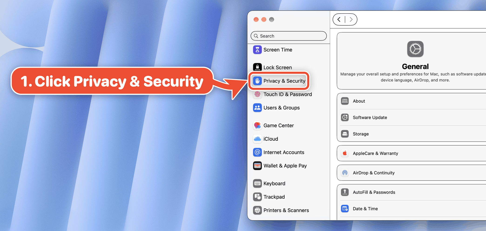
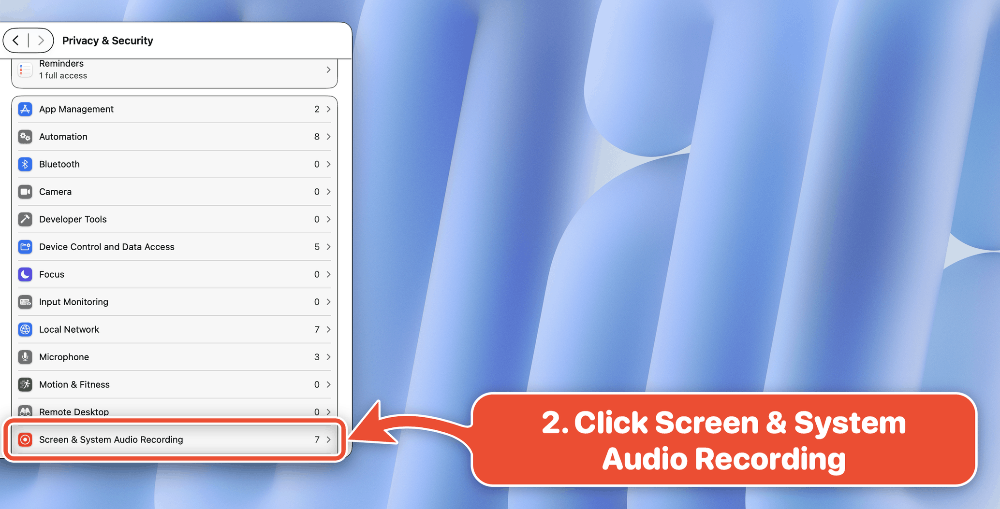
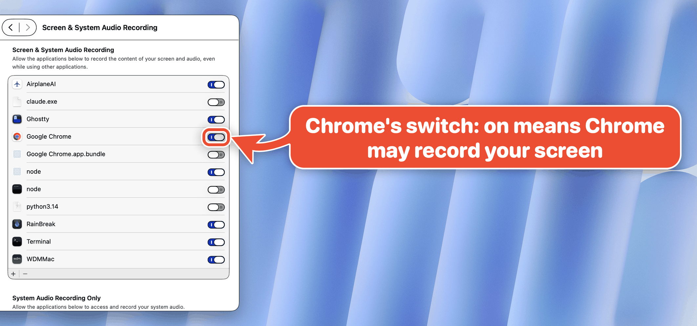
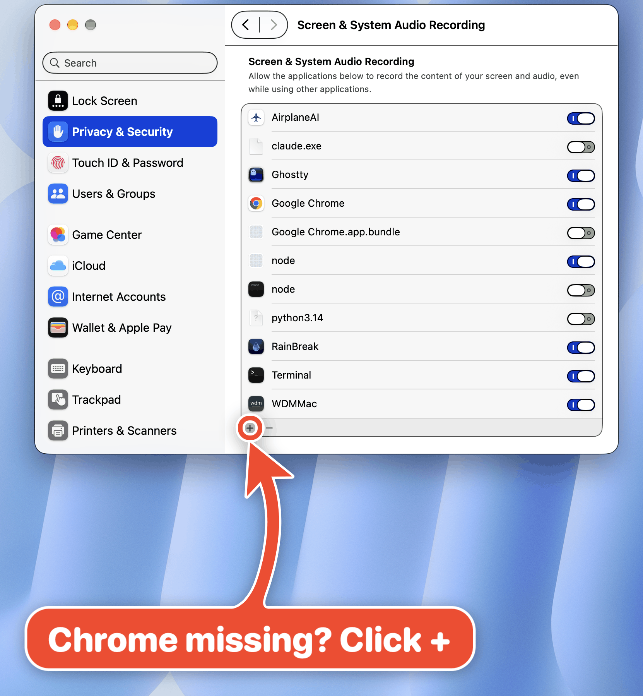
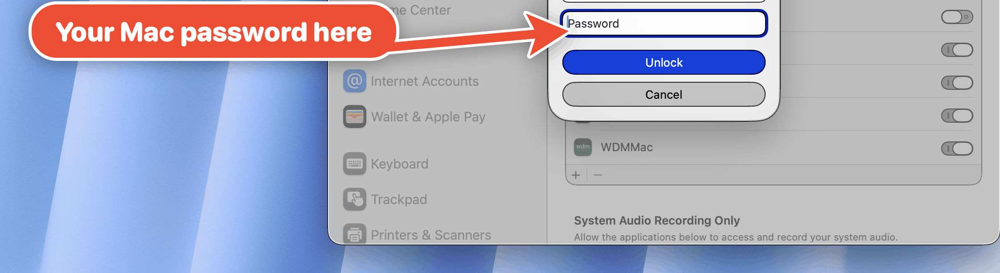

# How to allow screen recording on a Mac

Let an app record your screen on macOS: Google Chrome here, the same steps for Zoom, Teams, TeamViewer or any app that shares your screen. Every screenshot is a real arrow an agent drew with [bigarrow](../../../README.md) on macOS 27.0.1 (26A434). The steps follow Apple's [Control access to screen and system audio recording on Mac](https://support.apple.com/guide/mac-help/control-access-screen-system-audio-recording-mchld6aa7d23/mac#:~:text=Choose%20Apple%20menu), checked on 2026-10-09. Also as a [PDF](how-to-allow-screen-recording-on-a-mac.pdf).

## 1. Open Privacy & Security

Apple menu > **System Settings**, then **Privacy & Security** in the sidebar (scroll down if needed).



```bash
bigarrow start --app "System Settings" --text "1. Click Privacy & Security" \
  --element "Privacy & Security" --role button --from left
```

## 2. Open Screen & System Audio Recording

Scroll down and click **Screen & System Audio Recording**.



```bash
bigarrow start --app "System Settings" --text "2. Click Screen & System Audio Recording" \
  --element "Screen & System Audio Recording" --role button --from right
```

Shortcut: one deep link does steps 1 and 2.

```bash
open "x-apple.systempreferences:com.apple.preference.security?Privacy_ScreenCapture"
```

## 3. Find the app and switch it on

Turn on the app's switch. On: it may record your screen. Off: it may not. (Chrome's is already on here.)



```bash
bigarrow start --app "System Settings" --text "Chrome's switch: on means Chrome may record your screen" \
  --element "Google Chrome_Toggle" --from right
```

## 4. App not in the list? Click +

Apps usually add themselves the first time they try to record. Missing? Click **+** under the list and pick it in Applications.



```bash
bigarrow start --app "System Settings" --text "Chrome missing? Click +" --element Add --from bottom
```

## 5. Confirm with your Mac password

Turning a switch on shows a sheet: "Privacy & Security is trying to unlock system settings." Your user name is filled in. Type your Mac login password and click **Unlock**. **Cancel** leaves the switch off.



```bash
bigarrow start --app "System Settings" --text "Your Mac password here" --at <x,y low in the Password field> \
  --from left --size S --shape straight
```

The shot is cropped below the user name. The script pressed an off switch (python3.14), photographed the sheet, clicked Cancel and checked the switch was off again. No password typed, no permission changed.

## 6. Quit & Reopen

If the app is open, macOS says it cannot record until you quit and reopen it. Click **Quit & Reopen**. Done. Apple's page skips this prompt; see [UNC Asheville IT](https://kb.unca.edu/kb/allow-an-app-to-record-your-mac-s-screen#:~:text=Quit%20%26%20Reopen). Text only: showing it would mean really granting a permission on the test Mac.

## Let your agent do it

The five lines an agent runs to walk a human through it:

```bash
open "x-apple.systempreferences:com.apple.preference.security?Privacy_ScreenCapture"
bigarrow elements --app "System Settings" --match Chrome --json      # the switch's id: "Google Chrome_Toggle"
bigarrow start --element "Google Chrome_Toggle" --app "System Settings" --text "Switch this on: Chrome may record your screen" --until-click
bigarrow start --element Password --role textfield --app "System Settings" --text "Your Mac password here" --until-click
bigarrow stop --all
```

`--until-click` removes each arrow once the human clicks its target; `stop --all` cleans up the rest. Screenshots by [`scripts/guide-screen-recording.sh`](../../../scripts/guide-screen-recording.sh).
