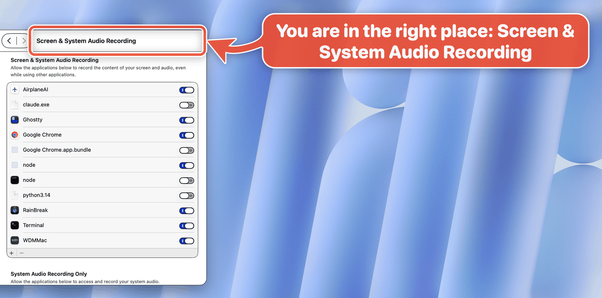

# How to allow screen recording on a Mac

This guide shows how to let an app record your screen on macOS: Google Chrome here, and the same steps work for Zoom, Microsoft Teams, TeamViewer or any other app that shares or records your screen. Every screenshot is a real arrow, drawn by an agent with [bigarrow](../../../README.md) on macOS 27.0.1 (build 26A434).

## 1. Open Screen & System Audio Recording

Open **System Settings > Privacy & Security > Screen & System Audio Recording**.



```bash
open "x-apple.systempreferences:com.apple.preference.security?Privacy_ScreenCapture"
bigarrow start --app "System Settings" --text "You are in the right place: Screen & System Audio Recording" \
  --element "Screen & System Audio Recording" --role statictext --from right
```

## 2. Find the app and switch it on

Find the app in the list and turn on its switch. On: the app may record your screen. Off: it may not. (On this Mac, Chrome's switch is already on.)


```bash
bigarrow start --app "System Settings" --text "Chrome's switch: on means Chrome may record your screen" \
  --element "Google Chrome_Toggle" --from right
```

## 3. App not in the list? Click +

Apps usually add themselves to the list the first time they try to record. If yours is missing, click **+** under the list and pick the app in Applications.


```bash
bigarrow start --app "System Settings" --text "Chrome missing? Click +" --element Add --from bottom
```

## 4. Confirm with your password or Touch ID

macOS asks for your login password or Touch ID before it changes the setting. That proves it is you, not an app, flipping the switch.

## 5. Quit & Reopen

macOS then tells you the app needs to restart before it can record. Click **Quit & Reopen**. After that the app can share or record your screen.

Steps 4 and 5 are text only: we only point on our test Mac, and we never grant or revoke a permission there.

## Let your agent do it

The five lines an agent runs to walk a human through this:

```bash
open "x-apple.systempreferences:com.apple.preference.security?Privacy_ScreenCapture"
bigarrow elements --app "System Settings" --match Chrome --json      # the switch's id: "Google Chrome_Toggle"
bigarrow start --element "Google Chrome_Toggle" --app "System Settings" --text "Switch this on: Chrome may record your screen" --until-click
bigarrow start --element Add --app "System Settings" --text "Chrome missing? Click +" --until-click
bigarrow stop --all
```

`--until-click` takes each arrow down as soon as the human clicks its target. `bigarrow stop --all` cleans up whatever is still up. The screenshots come from [`scripts/guide-screen-recording.sh`](../../../scripts/guide-screen-recording.sh).
