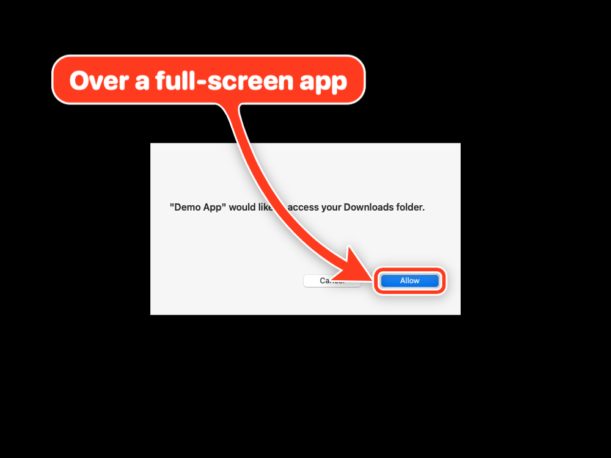
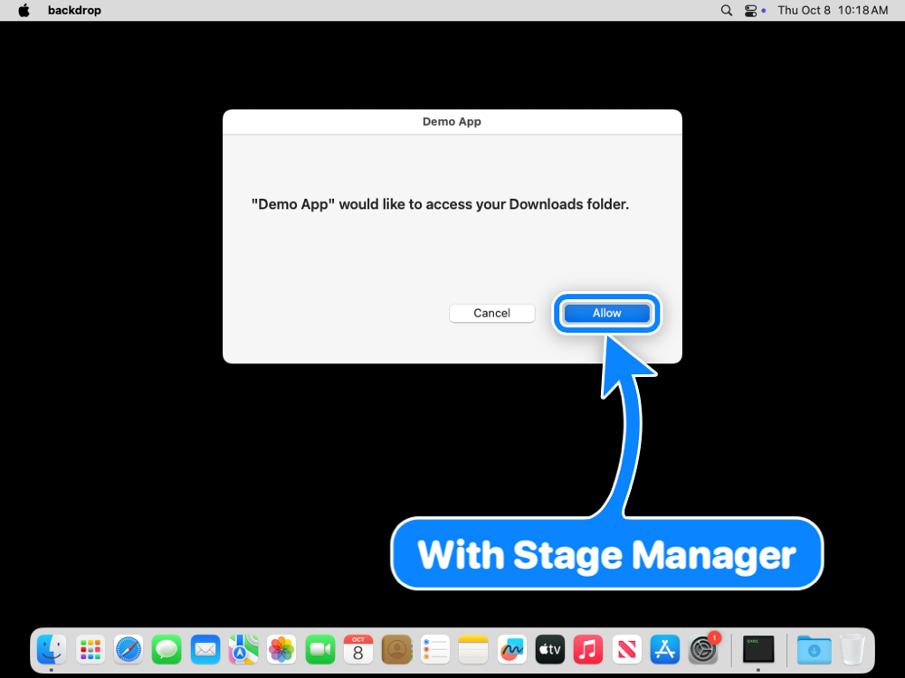
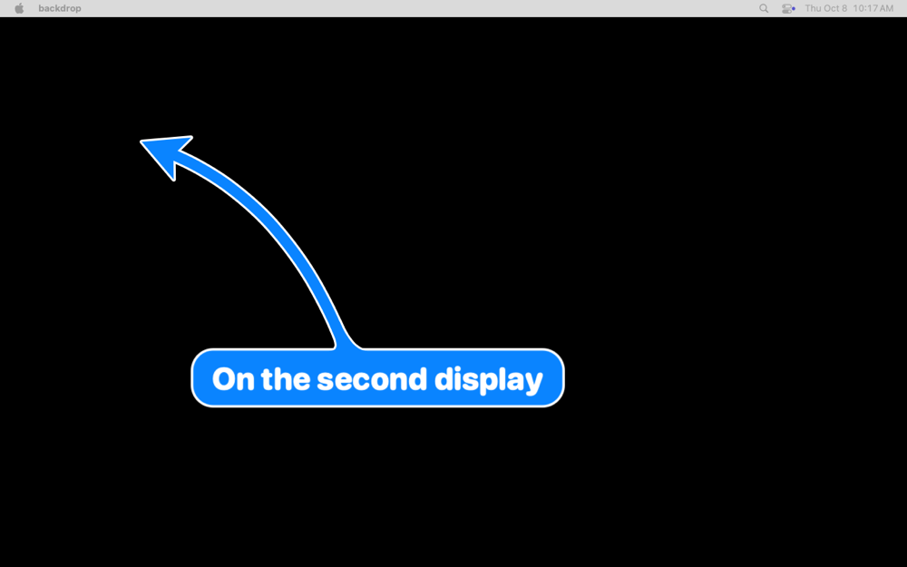
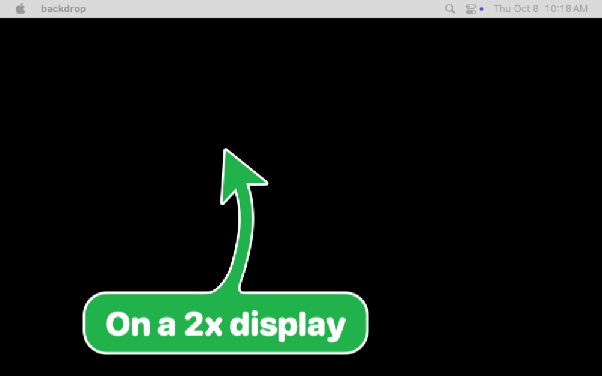
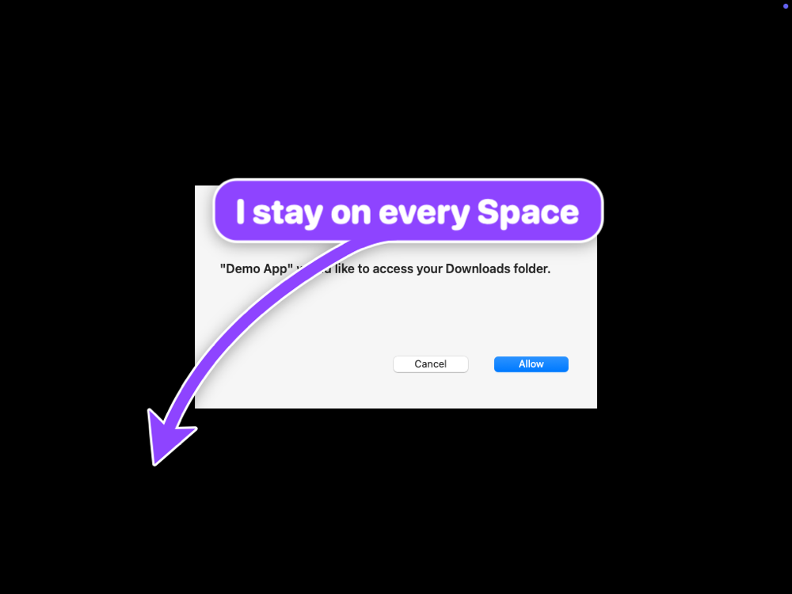

# Verification: displays, Spaces, full screen, Stage Manager, behaviour

Ticket T16 matrix plus the behaviour checks of M3. Every row was run by a script, not by hand.

Where: **CI** = GitHub Actions `macos-15` runner (macOS 15.7, clean desktop, Accessibility and
Screen Recording granted), via `scripts/behaviour-check.sh` in
[visual.yml](../../.github/workflows/visual.yml), run
https://github.com/franzenzenhofer/big-arrow-on-the-screen/actions/runs/37762304745 .
**MBP** = the planning MacBook Pro (macOS 26.1, built-in display at 2x), `swift test` with the
screen tests on. **Arthur** = Arthur Mac (macOS 27.0.1), `BIGARROW_SCREEN_TESTS=1 swift test` in its GUI session.

| Case | Result | Where, date | Evidence |
|---|---|---|---|
| Overlay at window level 1000, covering the display | pass | CI, MBP, Arthur, 2026-10-08 | `OverlayTests` |
| Clicks pass through the arrow to the window below | pass | CI, MBP, Arthur, 2026-10-08 | `OverlayTests` hit test |
| Frontmost app unchanged by `point`, `start`, `--detach` | pass | CI, MBP, Arthur, 2026-10-08 | `OverlayTests`; root cause of the one failure found: `NSApplication.run()` activates detached processes, replaced by a plain event pump |
| Sign pixels have the arrow colour | pass | CI, MBP, 2026-10-08 | `OverlayTests` pixel check |
| Above a full-screen app, which keeps its Space and the focus | pass | CI, 2026-10-08 |  pixel 255,83,39 |
| Stage Manager on | pass | CI, 2026-10-08 |  pixel 0,153,255 |
| Second display (virtual, right of main), `--display 2` | pass | CI, 2026-10-08 |  |
| Second display in a 2x pixel mode | pass | CI, 2026-10-08 |  |
| Display scale 2 (built-in Retina) and scale 1 | pass | MBP (2x), CI (1x), 2026-10-08 | `OverlayTests` on both |
| Display unplugged while an arrow is up: the arrow ends, exit 0 | pass | CI, 2026-10-08 | `displayGone`, via removing the virtual display |
| Displays with negative origins (above or left of main) | pass | unit tests with the planning Mac's real 3-display layout | `ScreenSpaceTests` |
| Close button: a real click on the X ends the arrow, focus unchanged | pass | CI, 2026-10-08 | behaviour check |
| `--until-click`: a click on the target ends it with `clicked` | pass | CI, 2026-10-08 | behaviour check |
| `--follow`: the arrow moves with its target, `targetGone` when it closes | pass | CI, 2026-10-08 | behaviour check (through `--element`, see below) |
| `--raise` brings the target app to the front | pass | CI, 2026-10-08 | behaviour check |
| `--say` speaks; `stop` silences it within 300 ms | pass | CI, 2026-10-08 | behaviour check |
| CPU while the head pulses (sticky arrow) | 1.4 % (target under 3 %) | CI, 2026-10-08 | behaviour check |
| Switching Spaces while an arrow is up (an app goes full screen into a new Space) | pass | CI, 2026-10-08 |  |

## Notes

- On GitHub's virtual machines `CGWindowListCopyWindowInfo` reported a window at `y = -252`
  while Accessibility and the screenshot had it at `y = 124` (see the addendum in
  `docs/research/2026-10-08-macos-overlay-apis-and-prior-art.md`). `--follow` is therefore
  checked through an `--element` target there; it is the same follow code for windows and
  elements. On real Macs both sources agree.
- On the runner, AppKit reports backing scale 1 for the virtual display even in its 2x pixel
  mode; scale 2 is covered by the MacBook's built-in display.
- Arthur Mac's screen was locked during the run, so its tests cover the window server but no
  pixels; remote unlocking over VNC and posted key events was refused by the lock screen.
